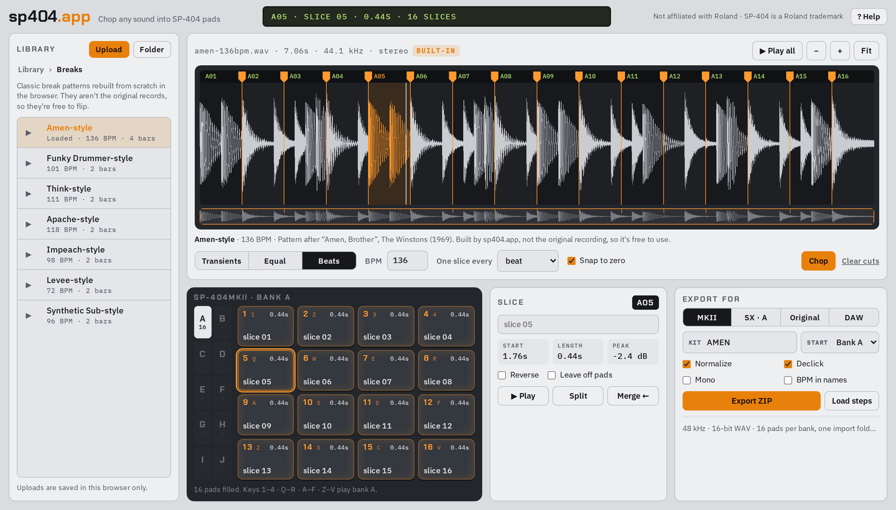

<h1 align="center">sp404.app</h1>

<p align="center">
  <b>Chop any sound into SP-404 pads, right in your browser.</b><br>
  Pick a break from the library or upload your own · slice it by transients, equal parts or beats · play it on the pads · export a card-ready ZIP
</p>

<p align="center">
  <a href="https://npcmillionaire.github.io/sp404-app/"><b>Open the web app →</b></a>
  &nbsp;·&nbsp;
  <a href="#how-to-use-the-web-app">How to use it</a>
  &nbsp;·&nbsp;
  <a href="#download-it-and-run-it-offline">Run it offline</a>
  &nbsp;·&nbsp;
  <a href="#use-it-as-a-vst-in-your-daw">Use it as a VST</a>
</p>

<p align="center">
  <picture>
    <source media="(prefers-color-scheme: dark)" srcset="docs/screenshot-dark.png">
    
  </picture>
</p>

---

## What it does

Getting a sample onto an SP-404 usually means chopping it in a DAW, bouncing every slice, renaming files, converting the sample rate, and then working out which folder the sampler wants. sp404.app does all of that in one page:

- **Comes with sounds to chop.** A built-in library of classic-style breaks, drum kits, loops and stabs, plus a **My samples** folder for your own uploads.
- **Chops automatically.** Find every hit (transients), split into 2–64 equal parts, or cut on the beat grid at your BPM.
- **Lets you fix the cuts by hand.** Drag markers, add or delete cuts, split or merge slices, snap to zero crossings so nothing clicks.
- **Maps slices to real pads.** Slices fill banks A–J in order, 16 pads per bank on the MKII and 12 on the SX, A and original. Play them from the on-screen pads or your keyboard.
- **Exports exactly what each sampler wants.** The right sample rate, bit depth, file names and folder layout for the **SP-404MKII**, **SP-404SX / SP-404A**, the **original SP-404**, or a **DAW** (WAVs plus a playable SFZ kit).
- **Tells you how to load it.** Every ZIP includes a pad map and the step-by-step import instructions for the model you picked.

**Your audio never leaves your computer.** It's decoded, chopped and zipped inside your browser. Files you upload are saved in that browser's own storage so they're there next time, but they're never sent to a server. There's no account and no tracking.

## The library

The **Library** panel on the left works like a sampler's file browser: click a folder to open it, click **▶** to preview a sound, and click its name to load it into the editor. Built-in sounds load already chopped, with their tempo set and (for kits and stabs) their pads named.

| Folder | What's in it |
|---|---|
| **Breaks** | Amen-style (136 BPM), Funky Drummer-style (101), Think-style (111), Apache-style (118), Impeach-style (98), Levee-style (72), Synthetic Sub-style (96) |
| **Drum kits** | 808-style kit and a dusty acoustic kit, 8 named one-shots each |
| **Loops** | Boom-bap loop (92 BPM) and Dusty keys, four electric-piano chords (84 BPM) |
| **Stabs & hits** | Six jazz chord stabs and four orchestra hits |
| **My samples** | Everything you upload, in your own folders |

> [!NOTE]
> The breaks follow the drum patterns and tempos of famous records, but **they aren't the original recordings**. Every built-in sound is synthesized from scratch in your browser, so they're free to chop, flip and release. If you own a copy of the original break, upload it and chop it the same way.

**Adding your own sounds:** click **Upload** to add audio files, or **Folder** to add a whole folder (its subfolders are kept). You can also drag files or folders anywhere onto the page. They go into **My samples** (inside the folder you have open, if you're already in one). To delete a file or folder, click **✕** and then **Delete?** to confirm. Uploads live in that browser only, so they won't follow you to another browser or computer, and clearing your browser's site data removes them.

## How to use the web app

The Amen-style break loads when the page opens, already chopped across bank A, so you can try every control before you use your own audio.

The whole app fits on one screen on a laptop or desktop (about 1180 px wide or more), so there's no scrolling. The library is on the left, the waveform and chop controls are in the middle, and the pads, the selected slice and the export settings are along the bottom. On a tablet or phone it stacks into one column. Click **? Help** in the top right for the mouse and keyboard shortcuts.

1. **Open the app.** Go to the [web app](https://npcmillionaire.github.io/sp404-app/) in Chrome, Edge, Firefox or Safari on a computer, or [run it offline](#download-it-and-run-it-offline).
2. **Load a sound.** In the **Library**, open a folder and click a sound's name (**▶** previews it first). To use your own audio, click **Upload** (or **Folder**), or drag files onto the page. WAV, AIFF, MP3, FLAC, OGG and M4A all work (M4A and OGG depend on your browser). The file name, length, sample rate and channels show above the waveform.
3. **Choose how to chop it** with the **Transients / Equal / Beats** buttons under the waveform, then click **Chop**:

   | Mode | Use it for | Settings |
   |---|---|---|
   | **Transients** | Drum breaks, one-shots, anything with clear hits | **Sensitivity** (higher finds more hits) and **Min gap** (the shortest slice allowed, in ms) |
   | **Equal** | Pads, textures, vocal phrases, evenly spaced chops | **Slices**: 2 to 64 |
   | **Beats** | Loops that are already in time | **BPM** and **One slice every** (1/16 note up to 2 bars) |

   Leave **Snap to zero** on. It nudges each cut to the nearest point where the waveform crosses zero, which stops clicks.
4. **Fine-tune the cuts** on the waveform:

   | To… | Do this |
   |---|---|
   | Hear a slice | Click it |
   | Add a cut | Double-click where you want it |
   | Move a cut | Drag the orange marker |
   | Remove a cut | Click the marker, then press **Delete** |
   | Zoom | Scroll, or use **−** / **+** / **Fit** |
   | Move along the file | Shift-scroll, drag the waveform, or click the overview strip underneath |
   | Hear the whole file | **▶ Play all** (the selected pad follows the playhead) |

5. **Play and tidy the pads.** Click a pad, or use your keyboard: **1 2 3 4 / Q W E R / A S D F / Z X C V** play pads 1–16 of the bank on screen (the first 12 on 12-pad models), and **← →** step through slices. Switch banks with the **A–J** buttons. For the selected slice you can:
   - **Name** it (the name goes into the file name, e.g. `A05 chord.wav`)
   - **Reverse** it
   - **Leave off pads** (quiet lead-ins are left off automatically)
   - **Split** it in half, or **Merge ←** it with the previous slice
6. **Pick where it's going** under **Export for**: **MKII**, **SX · A**, **Original** or **DAW**. The pads redraw for that model (16 or 12 per bank).
7. **Set the kit options.**
   - **Kit** is the kit name used for folder and file names (it defaults to the sound's name).
   - **Start** picks the bank; the first slice goes on pad 1 of that bank, so you don't overwrite banks you already use.
   - **Normalize** brings each slice up to −0.3 dB peak.
   - **Declick** adds a very short fade in and out to every pad.
   - **Mono** halves the file size, which helps on the SX's limited memory.
   - **BPM in names** adds e.g. `92bpm` (MKII and DAW).
8. **Click Export ZIP.** Click **Load steps** next to it to see the files that go in the ZIP and how to load them on your model. The same steps are in the ZIP's pad map file.

Your settings (mode, sensitivity, target, kit name, options) are remembered in that browser for next time.

### What each export looks like

| Export for | Audio | Pads per bank | What's in the ZIP |
|---|---|---|---|
| **MKII** | 48 kHz · 16-bit WAV | 16 | `IMPORT/<kit> A/A01 name.wav` — one folder per bank |
| **SX · A** | 44.1 kHz · 16-bit WAV | 12 | `ROLAND/IMPORT/001_<kit>_A01_name.wav` — numbered so they import in order |
| **Original** | 44.1 kHz · 16-bit WAV | 12 | `FLIP0A01.WAV` — short 8.3 names (first 5 letters of the kit + pad) for the root of the CF card |
| **DAW** | Source sample rate · 16-bit WAV | 16 | `<kit>/<kit> A01 name.wav` plus `<kit>.sfz`, a kit that plays pad 1 on MIDI note 36 |

Every ZIP also has a pad map (`<kit> pad map.txt`, or `PADMAP.TXT` for the original) listing each pad, its length, its file and the load steps. For example, a MKII export of the Amen-style break:

```
AMEN - SP-404MKII.zip
  IMPORT/
    AMEN A/
      A01.wav
      A02.wav
      …
      A16.wav
  AMEN pad map.txt
```

### Loading it on the sampler

<details>
<summary><b>SP-404MKII</b></summary>

1. Unzip, then copy the `IMPORT` folder to the top level of the SD card. If the card already has one, merge them.
2. Put the card in the MKII, hold **SHIFT** and press pad 13, then choose **IMPORT → SD-CARD → SAMPLE**.
3. Open the `<kit> A` folder, select its files and import them starting at pad 1 of that bank. They fill pads in name order.
4. Repeat for each bank folder.
</details>

<details>
<summary><b>SP-404SX / SP-404A</b></summary>

1. Unzip, then copy the `ROLAND` folder to the top level of the SD card, merging with the one already there.
2. On the 404, hold **FUNC** and press pad 3 (IMPORT).
3. Choose the bank and the pad to start from, then press **REC**. Files load in number order (001, 002, …).
</details>

<details>
<summary><b>Original SP-404</b></summary>

1. Unzip, then copy the `.WAV` files to the top level of the CF card.
2. On the 404, hold **CANCEL** and press **RESAMPLE**, then press **REC**.
3. Pick the bank and pad, then press **REC** again to load.
</details>

> [!NOTE]
> These load steps haven't been checked on every model and firmware yet. If a step doesn't match what your sampler shows, please [open an issue](https://github.com/NPCmillionaire/sp404-app/issues).

## Download it and run it offline

sp404.app is a single web page with no build step and nothing to install. The copy in this repo has its fonts and ZIP library bundled, so it works with no internet connection at all.

**Option 1: download the ZIP (no tools needed)**

1. Download the repo: [**sp404-app-main.zip**](https://github.com/NPCmillionaire/sp404-app/archive/refs/heads/main.zip).
2. Unzip it anywhere, for example your Documents folder.
3. Open `sp404-app-main/web/` and double-click **`index.html`**. It opens in your default browser.
4. Optional: bookmark the page, or keep the `web` folder on a USB stick next to your sample library.

Keep the `vendor` folder next to `index.html`. The page needs it for the ZIP export and the fonts.

**Option 2: clone it with git**

```bash
git clone https://github.com/NPCmillionaire/sp404-app.git
cd sp404-app/web
open index.html          # macOS
# start index.html       # Windows
# xdg-open index.html    # Linux
```

**Option 3: serve it locally** (handy if your browser is strict about opening local files)

```bash
cd sp404-app/web
python3 -m http.server 8000     # or: npx serve .
# then open http://localhost:8000
```

To update, download the ZIP again or run `git pull`.

## Use it as a VST in your DAW

> [!IMPORTANT]
> **There isn't a native plugin version yet** ([see the roadmap](#native-plugin-roadmap)). Today you get the same result with a **free SFZ player plugin**: sp404.app does the chopping and builds the kit, and the plugin plays it from MIDI inside Ableton, FL Studio or any other DAW. The steps below use [sfizz](https://sfz.tools/sfizz/), which is free and open source.

### 1. Export a DAW kit from sp404.app

1. Chop your sample as usual.
2. Under **Export for**, choose **DAW**, give the kit a name, and click **Export ZIP**.
3. Unzip it somewhere permanent, such as `Documents/SP404 Kits/`. Don't move or rename the files afterwards, because the kit finds its samples by name.

You'll get a folder like this:

```
FLIP01/
  FLIP01 A01.wav
  FLIP01 A02.wav
  …
  FLIP01.sfz      ← the file you load into the plugin
```

### 2. Download and install the sfizz plugin

1. Go to the [sfizz downloads page](https://sfz.tools/sfizz/downloads) and pick your system:
   - **Windows:** the 64-bit installer.
   - **macOS:** the Universal installer (Intel and Apple silicon).
   - **Linux:** the packages from the openSUSE repository linked on that page.
2. Run the installer. It puts the plugin in your system's standard plugin folder:

   | System | Format | Folder |
   |---|---|---|
   | Windows | VST3 | `C:\Program Files\Common Files\VST3\` |
   | macOS | VST3 | `/Library/Audio/Plug-Ins/VST3/` |
   | macOS | Audio Unit | `/Library/Audio/Plug-Ins/Components/` |
   | Linux | VST3 / LV2 | `~/.vst3/` or `/usr/lib/vst3/`, and the LV2 folder |

3. **macOS only:** if the installer is blocked because it's from an unidentified developer, right-click it and choose **Open**, or allow it in **System Settings → Privacy & Security**.

### 3. Load your kit in your DAW

<details open>
<summary><b>Ableton Live</b></summary>

1. Open **Settings → Plug-Ins** (Preferences on older versions). Turn on **Use VST3 Plug-in System Folders** (and the **Audio Units** option on a Mac), then click **Rescan**.
2. In the browser, go to **Plug-Ins → sfizz** and drag it onto a new MIDI track.
3. In the sfizz window, use the file selector at the top (click where it shows the file name) and open your kit's `.sfz` file.
4. Play MIDI note 36 (**C1** in Live) and up: pad A01 is C1, A02 is C#1, and so on. Draw notes in a clip or play them from a controller.
</details>

<details open>
<summary><b>FL Studio</b></summary>

1. Open **Options → Manage plugins** and click **Find installed plugins** so FL Studio picks up sfizz.
2. In the Channel Rack, click **+** and choose **sfizz** (or find it under **Plugin database → Installed → Generators**).
3. In the sfizz window, use the file selector at the top (click where it shows the file name) and open your kit's `.sfz` file.
4. Play MIDI note 36 and up. FL Studio labels middle C as C5, so note 36 shows as **C3** in the piano roll: pad A01 is C3, A02 is C#3, and so on.
</details>

<details>
<summary><b>Logic, Bitwig, Reaper, Studio One and others</b></summary>

1. Rescan plugins if sfizz doesn't appear (Logic loads the Audio Unit version).
2. Put sfizz on an instrument or MIDI track and open your kit's `.sfz` file in it.
3. Play from MIDI note 36 up. Bitwig's own Sampler can also open `.sfz` files directly.
</details>

**Other free plugins that open the same kit:** [sforzando](https://www.plogue.com/products/sforzando.html) by Plogue (VST, VST3, AU, AAX and CLAP on Windows and macOS). [Decent Sampler](https://www.decentsamples.com/product/decent-sampler-plugin/) can import SFZ files too.

**Prefer no plugin at all?** In Ableton, select all the WAVs in the kit folder and drag them onto the first pad of an empty **Drum Rack**; they fill the pads in order. In Logic, drop them into **Drum Machine Designer** or **Quick Sampler**. In FL Studio, drag them into the Channel Rack.

### Native plugin (roadmap)

A native plugin (VST3 on Windows and macOS, plus AU for Logic) is planned: the same chopping screen inside your DAW, slices played from MIDI with no export step, and an optional classic SP-404-style sound. It isn't built yet. When it ships, installers will be attached to this repo's [Releases](https://github.com/NPCmillionaire/sp404-app/releases) page and this section will have the install steps.

## Troubleshooting

**"Couldn't read the file."** The browser couldn't decode it. Convert it to WAV or try a different browser. Chrome and Edge decode the most formats.

**Too many slices, or it split every hi-hat.** Lower **Sensitivity** or raise **Min gap**, then click **Chop** again. For loops that are already in time, **Beats** mode is cleaner.

**"X slices don't fit on the pads."** There are only 10 banks. Start at an earlier bank, merge slices, or tick **Leave off pads** on the ones you don't need.

**Clicks at the start or end of a pad.** Keep **Snap to zero** and **Declick** on.

**The sfizz kit is silent or missing samples.** Check the `.sfz` file is still in the same folder as its WAVs and nothing was renamed. Make sure the MIDI track sends notes from 36 up.

**My uploads disappeared.** They're stored in the browser you uploaded them in. A different browser, a private window, or clearing site data won't have them. Keep your originals on disk.

**Nothing happens when I click Export ZIP.** If you opened `index.html` from a download, check the `vendor` folder is still next to it. Otherwise, try [serving it locally](#download-it-and-run-it-offline).

## For developers

```
web/                   The whole app: one self-contained index.html
  vendor/              JSZip and font files, bundled so it works offline (no CDN)
docs/                  README screenshots
.github/workflows/     GitHub Pages deploy
```

- **No build step.** Edit `web/index.html` and reload.
- **Source of truth:** the app is also published as a claude.ai artifact, which loads the same fonts from Google Fonts and JSZip from cdnjs. The only functional difference in this copy is that those two tags point at `vendor/` (plus a proper `<head>` with a title, description and icon). After changing the artifact, re-export it here and swap those tags back.
- **Deployment:** pushes to `main` that touch `web/` publish it to GitHub Pages via [`.github/workflows/pages.yml`](.github/workflows/pages.yml).
- **How it works:** audio is decoded with the Web Audio API; transient detection is an energy-rise onset detector on 4 ms frames; resampling to 48 kHz or 44.1 kHz uses an `OfflineAudioContext`; WAVs are written as 16-bit PCM with TPDF dither; the ZIP is built with JSZip. Built-in library sounds are synthesized on the fly (`drumLoop()`, `V.*` voices, `reverb()`), and uploads are stored in IndexedDB (`DB`, `addFiles()`). See `detectOnsets()`, `renderSlice()` and `encodeWav()` in `web/index.html`.

## More SP-404 tools

- **[Padlift 404](https://github.com/NPCmillionaire/padlift-404)** goes the other way: SP-404 SD card → DAW-ready WAVs with your trims, loops, reverse and tempo kept.

## Credits

Made by [NPCmillionaire](https://github.com/NPCmillionaire). Uses [JSZip](https://stuk.github.io/jszip/) (MIT), and the [Chakra Petch](https://fonts.google.com/specimen/Chakra+Petch) and [IBM Plex](https://www.ibm.com/plex/) fonts (SIL Open Font License).

SP-404 is a trademark of Roland Corporation. sp404.app is an independent project and is not affiliated with or endorsed by Roland. sfizz, sforzando, Ableton Live and FL Studio are the property of their respective owners.
